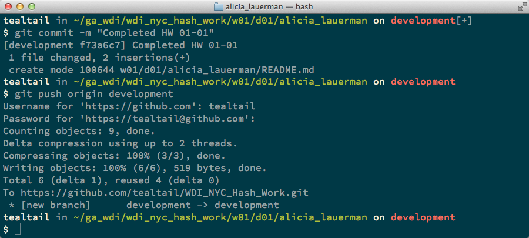

###WDI-HW Submission

######Open up a terminal window

- Move to your local `WDI_NYC_Array_Work` folder

```bash
cd path/to/ga_wdi/folder
cd WDI_NYC_Array_work
```


- Move to the folder with today's assignment and look at what is inside
	- The description of the homework is in the README.md file
	- Any associated code that you will need is in the ASSIGNMENT_FILES folder

```bash
cd w01
cd d01
ls
```


######Check out your development branch and make sure you are on the right branch

```bash
git branch development
git checkout development
git branch
```


######Move to your __OWN PERSONAL DIRECTORY__ and do the work
- Do NOT edit any files that are not in your personal directory
- Remember to save all your files


######Check status and add files to the stage

```bash
git status
git add .
git status
```


######Commit changes and push to Github

```bash
git commit -m "Complete HW 01-01"
git push origin development
```




######Merge changes in to master and push to Github

```bash
git checkout master
git branch
git merge development
git push origin master
```


######Make ONE pull request

---


---


---


---


---

You're DONE!
